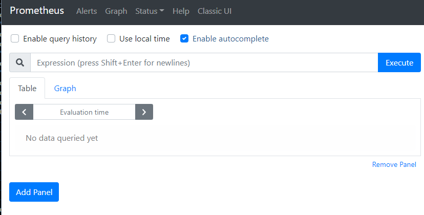
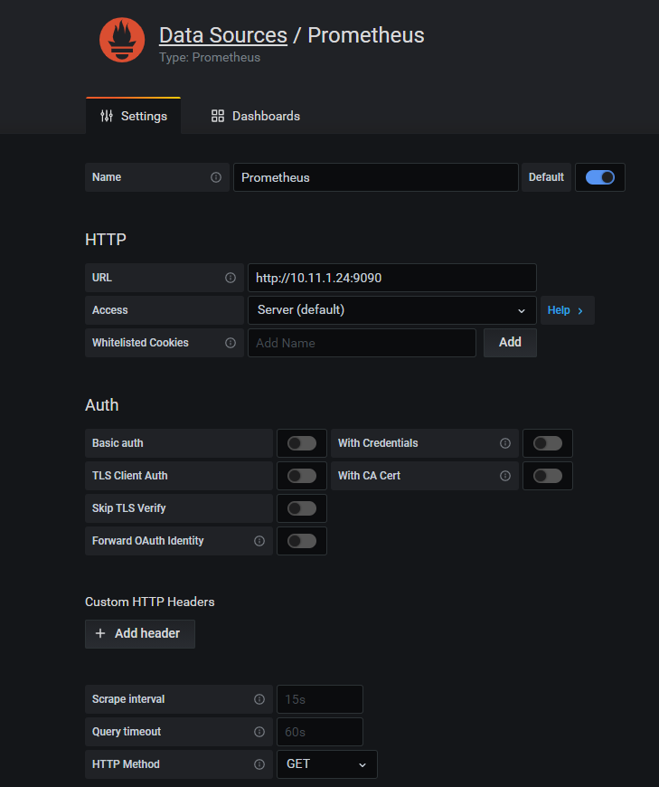
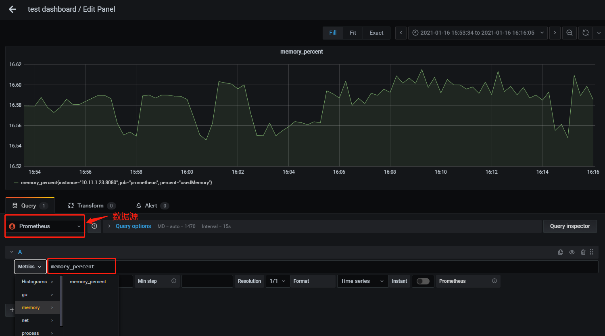

### 环境

- Centos7

- Grafana7.3.7
- Prometheus2.24

### 下载安装[Prometheus](https://prometheus.io/download/)

~~~bash
wget https://github.com/prometheus/prometheus/releases/download/v2.24.0/prometheus-2.24.0.linux-386.tar.gz

tar -xzvf prometheus-2.24.0.linux-386.tar.gz
~~~

#### 启动 `Prometheus`

~~~bash
./prometheus --config.file=prometheus.yml
~~~

#### 查看是否启动成功 `http://ip:9090`

<!--more-->

#### 修改prometheus 配置文件

~~~bash
scrape_configs:
  # The job name is added as a label `job=<job_name>` to any timeseries scraped from this config.
  - job_name: 'prometheus'

    # metrics_path defaults to '/metrics'
    # scheme defaults to 'http'.

    static_configs:
    - targets: ['10.11.1.23:8080'] #采集golang服务数据
~~~

### 下载安装[Grafana](https://grafana.com/grafana/download)

~~~bash
wget https://dl.grafana.com/oss/release/grafana-7.3.7-1.x86_64.rpm
sudo yum install grafana-7.3.7-1.x86_64.rpm
~~~

#### 启动

~~~bash
systemctl status grafana-server
systemctl start grafana-server
~~~

#### 配置文件在`/etc/sysconfig/grafana-server`

~~~bash
GRAFANA_USER=grafana

GRAFANA_GROUP=grafana

GRAFANA_HOME=/usr/share/grafana

LOG_DIR=/var/log/grafana

DATA_DIR=/var/lib/grafana

MAX_OPEN_FILES=10000

CONF_DIR=/etc/grafana

CONF_FILE=/etc/grafana/grafana.ini

RESTART_ON_UPGRADE=true

PLUGINS_DIR=/var/lib/grafana/plugins

PROVISIONING_CFG_DIR=/etc/grafana/provisioning

# Only used on systemd systems
PID_FILE_DIR=/var/run/grafana
~~~

#### 访问`Grafana` `http://ip:3000`

#### 添加Data Source

#### 添加 Panel

### golang 示例代码

~~~golang
package main

import (
    "github.com/prometheus/client_golang/prometheus"
    "github.com/prometheus/client_golang/prometheus/promhttp"
    "github.com/shirou/gopsutil/v3/mem"
    "log"
    "net/http"
    "time"
)

func main() {
    http.Handle("/metrics", promhttp.Handler())
    diskPercent := prometheus.NewGaugeVec(prometheus.GaugeOpts{
        Name: "memory_percent",
        Help: "memory use percent",
    },
    []string {"percent"})
    prometheus.MustRegister(diskPercent)

    // start web
    go func() {
        log.Println("ListenAndServe at :8080")
        err := http.ListenAndServe(":8080", nil)
        if err != nil {
            log.Fatal("ListenAndServe: ", err)
        }
    }()
    //收集内存使用的百分比
    for {
        log.Println("start collect memory used percent!")
        v, err := mem.VirtualMemory()
        if err != nil {
            log.Printf("get memeory use percent error: %s", err)
        }
        usedPercent := v.UsedPercent
        log.Println("get memory use percent:", usedPercent)
        diskPercent.WithLabelValues("usedMemory").Set(usedPercent)
        time.Sleep(time.Second*2)
    }
}
~~~

#### 未完待续